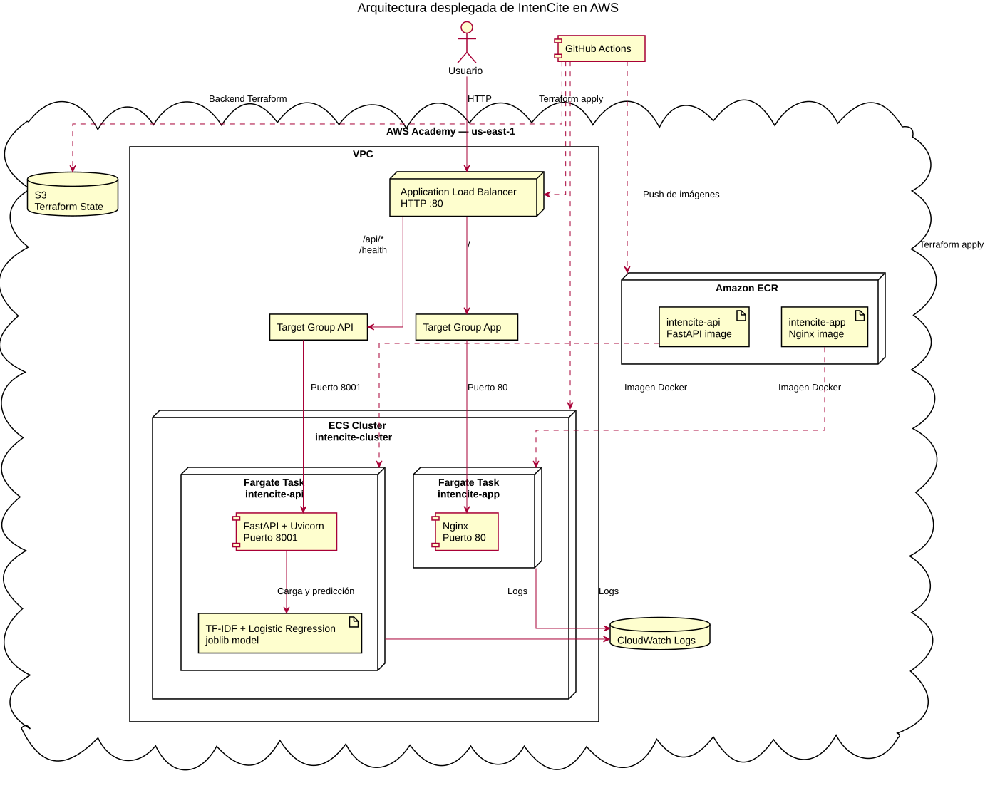
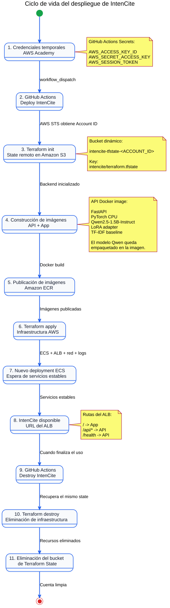
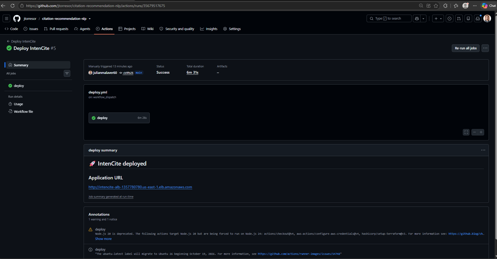
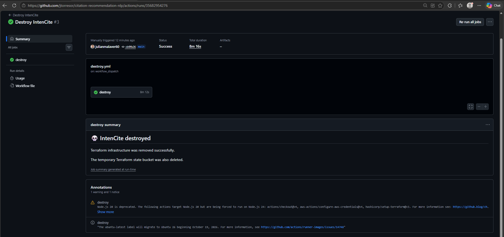

# Manual de Instalación - IntenCite

## 1. Introducción

Este manual describe los procedimientos necesarios para instalar, ejecutar, desplegar, verificar y eliminar la infraestructura de IntenCite.

IntenCite está compuesto por dos componentes principales de aplicación:

- **IntenCite App:** interfaz web estática servida mediante Nginx.
- **IntenCite API:** API desarrollada con FastAPI que expone los modelos de clasificación y realiza las predicciones.

La aplicación permite seleccionar entre dos modelos:

```text
TF-IDF + Logistic Regression
Qwen2.5 1.5B + LoRA
```

El modelo supervisado utilizado como línea base se encuentra en:

```text
models/tfidf_logreg_baseline_v1.joblib
```

El adaptador LoRA se encuentra en:

```text
models/lora_adapter/
```

y utiliza como modelo base:

```text
Qwen/Qwen2.5-1.5B-Instruct
```

IntenCite puede ejecutarse de dos formas:

1. Localmente mediante Docker Compose.
2. En AWS mediante GitHub Actions, Terraform, Amazon ECR, Amazon ECS con AWS Fargate y un Application Load Balancer.

---

## 2. Arquitectura de la solución

### 2.1 Arquitectura local

La ejecución local utiliza tres contenedores:

```text
Navegador
    |
    v
Nginx Gateway
   /       \
  /         \
App        API
Nginx    FastAPI
```

Los contenedores son:

```text
intencite-gateway
intencite-app
intencite-api
```

El gateway local escucha en el puerto `8080` y reproduce la responsabilidad de enrutamiento que realiza el Application Load Balancer en AWS.

Las rutas principales son:

| Ruta | Destino |
|---|---|
| `/` | Interfaz web servida por `intencite-app` |
| `/static/*` | Archivos estáticos de la interfaz |
| `/api/*` | API de inferencia en FastAPI |
| `/health` | Verificación de salud de la API |

La API también publica directamente el puerto `8001`, lo que permite utilizar Swagger o realizar pruebas directas sin pasar por el gateway.

### 2.2 Arquitectura en AWS

En AWS, el gateway local es reemplazado por un **Application Load Balancer**:

```text
Navegador
    |
    v
Application Load Balancer
       /           \
      /             \
IntenCite App    IntenCite API
   Nginx           FastAPI
```

El Application Load Balancer dirige:

```text
/               → servicio intencite-app
/api/*          → servicio intencite-api
/health         → servicio intencite-api
```

Los dos servicios se ejecutan mediante Amazon ECS con AWS Fargate.

Las imágenes se almacenan en repositorios privados de Amazon ECR y los registros de ejecución se envían a Amazon CloudWatch.



---

## 3. Estructura relevante del repositorio

```text
citation-recommendation-nlp/
├── .github/
│   └── workflows/
│       ├── deploy.yml
│       └── destroy.yml
├── api/
│   ├── Dockerfile
│   ├── main.py
│   ├── routes.py
│   └── schemas.py
├── app/
│   ├── Dockerfile
│   ├── index.html
│   ├── nginx.conf
│   └── static/
├── gateway/
│   └── nginx.conf
├── infra/
│   ├── intencite/
│   │   ├── alb.tf
│   │   ├── ecr.tf
│   │   ├── ecs.tf
│   │   ├── network.tf
│   │   ├── outputs.tf
│   │   ├── providers.tf
│   │   └── variables.tf
│   └── mlflow-server/
├── models/
│   ├── lora_adapter/
│   │   ├── adapter_config.json
│   │   ├── adapter_model.safetensors
│   │   └── README.md
│   └── tfidf_logreg_baseline_v1.joblib
├── src/
│   └── intencite/
│       ├── predict.py
│       └── predict_lora.py
├── docker-compose.intencite.yml
├── docker-compose.yml
├── requirements-api.txt
└── README.md
```

Los dos archivos Docker Compose de la raíz cumplen funciones diferentes:

- `docker-compose.intencite.yml` ejecuta IntenCite.
- `docker-compose.yml` ejecuta la infraestructura separada de MLflow y PostgreSQL.

Para ejecutar el producto localmente debe utilizarse:

```text
docker-compose.intencite.yml
```

---

## 4. Modelos incluidos

### 4.1 TF-IDF + Logistic Regression

El modelo base del proyecto se encuentra almacenado como:

```text
models/tfidf_logreg_baseline_v1.joblib
```

La versión de scikit-learn utilizada por la imagen de inferencia se mantiene compatible con el artefacto serializado.

### 4.2 Qwen2.5 1.5B + LoRA

El segundo modelo utiliza:

```text
Qwen/Qwen2.5-1.5B-Instruct
```

junto con el adaptador:

```text
models/lora_adapter/
```

El adaptador fue entrenado utilizando PEFT/LoRA.

Durante la inferencia, el sistema calcula una puntuación para cada una de las cinco etiquetas:

```text
Application
Background
Comparison
Gap
Improvement
```

La puntuación corresponde al promedio de las log-probabilidades de los tokens de cada etiqueta.

Para reducir el costo de inferencia, la implementación reutiliza mediante **KV cache** el estado calculado para el prompt compartido.

### 4.3 Empaquetado del modelo Qwen

El modelo base Qwen se descarga durante la construcción de la imagen Docker de la API.

La imagen utiliza PyTorch exclusivamente para CPU.

El modelo queda incluido dentro de la imagen, por lo que el contenedor desplegado no necesita descargar aproximadamente varios gigabytes desde Hugging Face cuando recibe la primera solicitud.

Durante la ejecución se utilizan las variables:

```text
HF_HUB_OFFLINE=1
TRANSFORMERS_OFFLINE=1
```

Esto permite utilizar el modelo empaquetado sin depender del acceso al Hugging Face Hub durante la inferencia.

---

## 5. Requisitos previos

### 5.1 Para ejecución local

Se requiere:

- Git.
- Docker Desktop o Docker Engine.
- Docker Compose v2.
- Un navegador web.
- Conexión a Internet durante la primera construcción de la imagen.
- Espacio disponible para almacenar la imagen del modelo.
- Al menos 8 GB de memoria disponibles para Docker.

Debido al tamaño de Qwen2.5 1.5B y sus dependencias, se recomienda disponer de más de 8 GB de memoria cuando sea posible.

Verifique las herramientas:

```bash
git --version
docker --version
docker compose version
```

Docker debe estar iniciado antes de construir los contenedores.

### 5.2 Para despliegue en AWS

Se requiere:

- Acceso al repositorio en GitHub.
- Acceso a AWS Academy.
- Una sesión activa del Learner Lab.
- Permiso para configurar GitHub Actions Secrets.
- Credenciales temporales vigentes.
- Disponibilidad del rol `LabRole`.

No es necesario instalar Terraform ni AWS CLI localmente para ejecutar el despliegue automatizado, porque estas herramientas se ejecutan en el runner de GitHub Actions.

---

## 6. Instalación y ejecución local

### 6.1 Clonar el repositorio

```bash
git clone https://github.com/jtorresor/citation-recommendation-nlp.git
cd citation-recommendation-nlp
```

Si el repositorio ya existe:

```bash
git pull
```

### 6.2 Verificar los archivos requeridos

Compruebe:

```bash
test -f api/Dockerfile
test -f app/Dockerfile
test -f gateway/nginx.conf
test -f docker-compose.intencite.yml
test -f models/tfidf_logreg_baseline_v1.joblib
test -f models/lora_adapter/adapter_config.json
test -f models/lora_adapter/adapter_model.safetensors
```

También puede revisar los modelos:

```bash
ls -lh models/
ls -lh models/lora_adapter/
```

La API no podrá cargar correctamente los modelos si estos artefactos no están presentes.

### 6.3 Construir las imágenes

Desde la raíz del repositorio:

```bash
docker compose -f docker-compose.intencite.yml build
```

Este proceso construye:

- `intencite-api`.
- `intencite-app`.

El gateway utiliza directamente una imagen Nginx ligera.

Durante la construcción de `intencite-api`:

1. Se instala PyTorch CPU.
2. Se instalan FastAPI, Transformers, PEFT, scikit-learn y demás dependencias.
3. Se descarga `Qwen/Qwen2.5-1.5B-Instruct`.
4. Se copia el código de la aplicación.
5. Se copia el baseline.
6. Se copia el adaptador LoRA.

> La primera construcción puede tardar varios minutos debido al tamaño de PyTorch y del modelo Qwen.

Las compilaciones posteriores pueden reutilizar capas de Docker cuando los archivos relacionados no han cambiado.

### 6.4 Iniciar la aplicación

```bash
docker compose -f docker-compose.intencite.yml up -d
```

La opción `-d` ejecuta los contenedores en segundo plano.

### 6.5 Verificar los contenedores

```bash
docker compose -f docker-compose.intencite.yml ps
```

Los contenedores esperados son:

```text
intencite-api
intencite-app
intencite-gateway
```

También puede utilizar:

```bash
docker ps
```

### 6.6 Consultar los registros

Para consultar todos los servicios:

```bash
docker compose -f docker-compose.intencite.yml logs
```

Para seguirlos:

```bash
docker compose -f docker-compose.intencite.yml logs -f
```

Solo API:

```bash
docker compose -f docker-compose.intencite.yml logs -f api
```

Solo interfaz:

```bash
docker compose -f docker-compose.intencite.yml logs -f app
```

Solo gateway:

```bash
docker compose -f docker-compose.intencite.yml logs -f gateway
```

### 6.7 Acceder a la aplicación

La entrada principal de la aplicación local es:

```text
http://localhost:8080
```

El tráfico pasa primero por el gateway Nginx.

La API también puede consultarse directamente en:

```text
http://localhost:8001
```

Swagger está disponible en:

```text
http://localhost:8001/docs
```

### 6.8 Verificar el gateway y la API

Verifique salud a través del gateway:

```bash
curl http://localhost:8080/health
```

Respuesta esperada:

```json
{
  "status": "ok"
}
```

Consulte los modelos:

```bash
curl http://localhost:8080/api/v1/models
```

Respuesta esperada:

```json
{
  "models": [
    {
      "id": "tfidf-logreg-baseline-v1",
      "name": "TF-IDF + Logistic Regression"
    },
    {
      "id": "qwen2.5-1.5b-lora-3ctx",
      "name": "Qwen2.5 1.5B + LoRA"
    }
  ]
}
```

La misma consulta puede realizarse directamente contra FastAPI:

```bash
curl http://localhost:8001/api/v1/models
```

### 6.9 Probar el baseline

```bash
curl -X POST "http://localhost:8080/api/v1/predict" \
  -H "Content-Type: application/json" \
  -d '{
    "context": "We use the parser introduced by Smith et al. to preprocess all documents in our corpus.",
    "model": "tfidf-logreg-baseline-v1"
  }'
```

La respuesta incluye:

- Modelo utilizado.
- Categoría predicha.
- Confianza.
- Probabilidad asignada a cada categoría.

### 6.10 Probar Qwen2.5 + LoRA

Ejemplo:

```bash
curl -X POST "http://localhost:8080/api/v1/predict" \
  -H "Content-Type: application/json" \
  -d '{
    "context": "To improve the robustness of our citation classification system, we adopt the attention-based encoding method introduced by <cite>Johnson et al.</cite> and use their pretrained scientific language model as the feature extractor in our architecture.",
    "model": "qwen2.5-1.5b-lora-3ctx"
  }'
```

La primera predicción con LoRA puede tardar más que las posteriores porque el proceso debe cargar Qwen y el adaptador en memoria.

Una vez cargado, el modelo permanece residente dentro del proceso de la API y las predicciones posteriores reutilizan esa instancia.

La latencia depende de los recursos de CPU, memoria y longitud del contexto.

### 6.11 Detener la aplicación

```bash
docker compose -f docker-compose.intencite.yml down
```

Este comando elimina los contenedores y la red creada por Compose, pero conserva las imágenes.

Para volver a iniciar:

```bash
docker compose -f docker-compose.intencite.yml up -d
```

### 6.12 Reconstruir después de modificar el código

Para reconstruir:

```bash
docker compose -f docker-compose.intencite.yml up -d --build
```

Para reconstruir únicamente la API:

```bash
docker compose -f docker-compose.intencite.yml build api
```

Después:

```bash
docker compose -f docker-compose.intencite.yml up -d --force-recreate api gateway
```

Evite utilizar `--no-cache` salvo que sea necesario, porque obliga a descargar e instalar nuevamente todas las dependencias y el modelo.

Si se requiere una reconstrucción completamente limpia:

```bash
docker compose -f docker-compose.intencite.yml build --no-cache
```

---

## 7. Despliegue automatizado en AWS

El despliegue se realiza mediante:

```text
.github/workflows/deploy.yml
```

La eliminación completa de la infraestructura se realiza mediante:

```text
.github/workflows/destroy.yml
```

Ambos workflows utilizan credenciales temporales de AWS Academy almacenadas como GitHub Actions Secrets.



---

## 8. Configuración de AWS Academy

### 8.1 Iniciar el laboratorio

1. Ingrese a AWS Academy.
2. Abra el Learner Lab correspondiente.
3. Presione **Start Lab**.
4. Espere hasta que la sesión esté activa.
5. Abra la sección de credenciales de AWS CLI.
6. Copie:

```text
aws_access_key_id
aws_secret_access_key
aws_session_token
```

Estas credenciales son temporales.

> Nunca almacene estas credenciales dentro del repositorio, Terraform, Dockerfiles, commits o documentación pública.

### 8.2 Crear los GitHub Actions Secrets

En GitHub:

1. Abra el repositorio.
2. Ingrese a **Settings**.
3. Abra **Secrets and variables**.
4. Seleccione **Actions**.
5. Presione **New repository secret**.
6. Cree:

| GitHub Secret | Valor de AWS Academy |
|---|---|
| `AWS_ACCESS_KEY_ID` | `aws_access_key_id` |
| `AWS_SECRET_ACCESS_KEY` | `aws_secret_access_key` |
| `AWS_SESSION_TOKEN` | `aws_session_token` |

Los nombres deben coincidir exactamente.

El workflow obtiene automáticamente el identificador de la cuenta mediante:

```bash
aws sts get-caller-identity --query Account --output text
```

La región utilizada es:

```text
us-east-1
```

### 8.3 Renovar las credenciales

Las credenciales expiran cuando finaliza la sesión del laboratorio.

Antes de ejecutar `Deploy IntenCite` o `Destroy IntenCite`:

1. Inicie el laboratorio.
2. Obtenga las credenciales vigentes.
3. Actualice los tres GitHub Secrets.
4. Ejecute el workflow.

No es necesario crear secrets nuevos. Se reemplazan sus valores.

---

## 9. Ejecutar el despliegue desde GitHub Actions

### 9.1 Iniciar el workflow

1. Abra **Actions**.
2. Seleccione **Deploy IntenCite**.
3. Presione **Run workflow**.
4. Seleccione la rama que desea desplegar.
5. Confirme la ejecución.
6. Observe los pasos de la ejecución.

Para desplegar la versión oficial del proyecto se recomienda ejecutar el workflow desde `main`.

### 9.2 Proceso realizado por el workflow

El workflow ejecuta:

1. Checkout del repositorio.
2. Configuración de Terraform.
3. Configuración de credenciales AWS.
4. Verificación de identidad mediante AWS STS.
5. Obtención del AWS Account ID.
6. Construcción del nombre del bucket de estado.
7. Creación o reutilización del bucket de Terraform.
8. Inicialización del backend remoto.
9. Creación inicial de los repositorios ECR.
10. Inicio de sesión en ECR.
11. Construcción de la imagen de la API.
12. Publicación de la imagen de la API.
13. Construcción de la imagen del tablero.
14. Publicación de la imagen del tablero.
15. Ejecución de `terraform apply`.
16. Creación o actualización de ECS, ALB, redes y demás recursos.
17. Forzado de un nuevo deployment de los servicios ECS cuando corresponde.
18. Espera hasta que los servicios estén estables.
19. Obtención de la URL del Application Load Balancer.
20. Publicación de la URL en el resumen de GitHub Actions.

El backend Terraform utiliza:

```text
Bucket: intencite-tfstate-<AWS_ACCOUNT_ID>
Key:    intencite/terraform.tfstate
Region: us-east-1
```

La inicialización corresponde a:

```bash
terraform init \
  -backend-config="bucket=${STATE_BUCKET}" \
  -backend-config="key=intencite/terraform.tfstate" \
  -backend-config="region=us-east-1" \
  -backend-config="use_lockfile=true"
```

El nombre del bucket depende de la cuenta AWS activa.

### 9.3 Reejecución de workflows

La opción **Re-run failed jobs** vuelve a ejecutar los jobs fallidos utilizando el mismo commit que originó la ejecución.

Por esta razón, si se modifica código, Terraform, Docker o cualquier otro archivo del repositorio, debe:

1. Crear un nuevo commit.
2. Enviarlo a GitHub.
3. Integrarlo en la rama que se desplegará.
4. Iniciar un nuevo workflow.

No debe utilizarse **Re-run failed jobs** para intentar aplicar cambios que no existían en el commit original.

---

## 10. Recursos creados en AWS

### 10.1 Amazon ECR

Se crean:

```text
intencite-api
intencite-app
```

`intencite-api` almacena la imagen que contiene:

- FastAPI.
- Baseline TF-IDF + Logistic Regression.
- Qwen2.5-1.5B-Instruct.
- Adaptador LoRA.
- PyTorch CPU.
- Transformers y PEFT.

`intencite-app` contiene la interfaz estática servida mediante Nginx.

### 10.2 Amazon ECS

Se crea:

```text
intencite-cluster
```

con los servicios:

```text
intencite-api
intencite-app
```

Cada servicio utiliza Fargate y red `awsvpc`.

### 10.3 Recursos de la API

La definición de tarea de la API utiliza:

```text
CPU:     2048
Memoria: 8192 MiB
```

Esta configuración corresponde a 2 vCPU y 8 GiB de memoria.

El modelo Qwen requiere significativamente más recursos que el baseline, por lo que la API utiliza una task mayor que el frontend.

Durante las pruebas locales, la API con Qwen cargado utilizó aproximadamente varios GiB de memoria, por lo que debe conservarse margen suficiente para el proceso de inferencia.

### 10.4 Recursos del frontend

La definición de tarea del tablero utiliza:

```text
CPU:     256
Memoria: 512 MiB
```

El frontend requiere pocos recursos porque Nginx únicamente sirve archivos estáticos.

### 10.5 Restricciones de AWS Academy

AWS Academy puede aplicar políticas organizacionales que restringen determinados tamaños de tareas Fargate.

Una configuración bloqueada por una Service Control Policy puede producir un error similar a:

```text
AccessDeniedException:
not authorized to perform ecs:RegisterTaskDefinition
with an explicit deny in a service control policy
```

La configuración validada para este proyecto en AWS Academy es:

```text
API:
CPU:     2048
Memoria: 8192 MiB
```

Si se ejecuta IntenCite en una cuenta AWS sin estas restricciones, los recursos pueden ajustarse en `infra/intencite/ecs.tf`.

### 10.6 Application Load Balancer

El ALB recibe tráfico HTTP y lo dirige a:

```text
/               → intencite-app
/api/*          → intencite-api
/health         → intencite-api
```

El tiempo de espera del ALB se amplía para permitir las inferencias del modelo Qwen:

```text
idle_timeout = 120 segundos
```

### 10.7 Red

El despliegue utiliza la VPC disponible en AWS Academy y sus subredes.

Los grupos de seguridad permiten:

- HTTP público hacia el ALB por el puerto `80`.
- Tráfico del ALB al frontend por el puerto `80`.
- Tráfico del ALB a la API por el puerto `8001`.

Los contenedores no necesitan exponer directamente sus puertos a Internet.

### 10.8 IAM

Las tareas ECS utilizan:

```text
LabRole
```

como execution role.

Este rol permite que ECS realice las operaciones necesarias disponibles dentro del entorno AWS Academy.

### 10.9 CloudWatch Logs

Se utilizan los log groups:

```text
/ecs/intencite-api
/ecs/intencite-app
```

Los registros permiten diagnosticar:

- Inicio de los contenedores.
- Errores de FastAPI.
- Carga del modelo.
- Problemas de infraestructura.
- Fallos durante la ejecución.

### 10.10 Amazon S3

El workflow utiliza:

```text
intencite-tfstate-<AWS_ACCOUNT_ID>
```

para almacenar el estado remoto de Terraform.

La clave es:

```text
intencite/terraform.tfstate
```

Este estado permite que ejecuciones posteriores conozcan la infraestructura existente.

---

## 11. Verificación del despliegue

### 11.1 Obtener la URL

Cuando GitHub Actions finaliza correctamente, el resumen de la ejecución presenta una URL similar a:

```text
http://<nombre-del-alb>.us-east-1.elb.amazonaws.com
```

La dirección puede cambiar después de destruir y reconstruir la infraestructura.



### 11.2 Abrir la aplicación

Abra:

```text
http://<DNS_DEL_ALB>
```

### 11.3 Verificar salud

```bash
curl "http://<DNS_DEL_ALB>/health"
```

Respuesta esperada:

```json
{
  "status": "ok"
}
```

### 11.4 Consultar los modelos

```bash
curl "http://<DNS_DEL_ALB>/api/v1/models"
```

Respuesta esperada:

```json
{
  "models": [
    {
      "id": "tfidf-logreg-baseline-v1",
      "name": "TF-IDF + Logistic Regression"
    },
    {
      "id": "qwen2.5-1.5b-lora-3ctx",
      "name": "Qwen2.5 1.5B + LoRA"
    }
  ]
}
```

### 11.5 Probar LoRA

```bash
curl -X POST "http://<DNS_DEL_ALB>/api/v1/predict" \
  -H "Content-Type: application/json" \
  -d '{
    "context": "To improve the robustness of our citation classification system, we adopt the attention-based encoding method introduced by <cite>Johnson et al.</cite> and use their pretrained scientific language model as the feature extractor in our architecture.",
    "model": "qwen2.5-1.5b-lora-3ctx"
  }'
```

Una respuesta válida incluye:

```text
model
prediction
confidence
probabilities
```

### 11.6 Verificación desde la interfaz

Seleccione:

```text
Qwen2.5 1.5B + LoRA
```

en el selector de la esquina superior derecha.

Ingrese el contexto y ejecute la clasificación.


La predicción debe mostrar:

- Categoría.
- Nivel de confianza.
- Distribución de probabilidades.

---

## 12. Actualizar una versión desplegada

Cuando se modifica la API, el tablero, los modelos o Terraform:

1. Guarde los cambios.
2. Cree un commit.
3. Envíe la rama a GitHub.
4. Integre los cambios en la rama que se desplegará.
5. Actualice las credenciales de AWS si expiraron.
6. Ejecute nuevamente `Deploy IntenCite`.

Ejemplo:

```bash
git add .
git commit -m "feat: update IntenCite application"
git push
```

El workflow volverá a construir las imágenes y aplicará la infraestructura requerida.

---

## 13. Destruir la infraestructura

Para eliminar completamente los recursos creados por IntenCite se utiliza:

```text
.github/workflows/destroy.yml
```

### 13.1 Ejecutar el workflow

1. Confirme que AWS Academy esté activo.
2. Actualice los tres GitHub Secrets.
3. Abra **Actions**.
4. Seleccione **Destroy IntenCite**.
5. Presione **Run workflow**.
6. Seleccione la rama correspondiente.
7. Confirme.
8. Espere a que termine correctamente.

### 13.2 Proceso de destrucción

El workflow:

1. Configura las credenciales AWS.
2. Obtiene el Account ID.
3. Reconstruye el nombre del bucket de estado.
4. Verifica que el bucket exista.
5. Inicializa Terraform.
6. Ejecuta:

```text
terraform destroy -auto-approve
```

7. Elimina todos los recursos administrados por Terraform.
8. Vacía el bucket temporal.
9. Elimina el bucket de estado.

> No elimine manualmente el bucket de Terraform antes de ejecutar el workflow de destrucción.

### 13.3 Verificación de la destrucción

Cuando el workflow finaliza correctamente, GitHub Actions muestra la ejecución `Destroy IntenCite` en estado exitoso.



La finalización exitosa confirma que Terraform eliminó los recursos administrados y que el workflow completó la limpieza del bucket utilizado para almacenar el estado remoto.

Después de la destrucción, la URL del Application Load Balancer deja de estar disponible.

### 13.4 Consideración para evaluación académica

No ejecute el workflow de destrucción antes de obtener las evidencias necesarias del despliegue o mientras la infraestructura deba permanecer disponible para revisión.

El workflow `destroy.yml` realiza una eliminación completa de los recursos y debe utilizarse únicamente cuando ya no sea necesario conservar la infraestructura desplegada.

---

## 14. MLflow

El archivo:

```text
docker-compose.yml
```

corresponde a la infraestructura separada de MLflow y PostgreSQL.

MLflow se utilizó para registrar y comparar los experimentos del proyecto, pero no necesita estar activo para utilizar los modelos empaquetados en IntenCite.

Esta infraestructura no debe confundirse con:

```text
docker-compose.intencite.yml
```

Para ejecutar MLflow se utiliza:

```bash
docker compose up -d
```

Para ejecutar IntenCite:

```bash
docker compose -f docker-compose.intencite.yml up -d
```

---

## 15. Solución de problemas

### 15.1 Docker no está disponible

Compruebe:

```bash
docker info
```

Verifique que Docker Desktop o Docker Engine esté iniciado.

### 15.2 El puerto está ocupado

Compruebe:

```bash
sudo lsof -i :8080
sudo lsof -i :8001
```

El puerto `8080` pertenece al gateway local y el `8001` corresponde a FastAPI.

### 15.3 Los modelos no aparecen en la interfaz

Compruebe:

```bash
curl http://localhost:8080/api/v1/models
```

Si este endpoint devuelve HTML en lugar de JSON, revise el gateway local:

```bash
docker compose -f docker-compose.intencite.yml logs gateway
```

También puede probar directamente:

```bash
curl http://localhost:8001/api/v1/models
```

### 15.4 La interfaz devuelve `502 Bad Gateway`

Compruebe:

```bash
docker compose -f docker-compose.intencite.yml ps
```

y revise:

```bash
docker compose -f docker-compose.intencite.yml logs gateway api
```

Un `502` durante el arranque puede aparecer si el gateway empieza a recibir solicitudes antes de que FastAPI haya terminado de iniciar.

Espere algunos segundos y vuelva a intentar.

### 15.5 La inferencia LoRA tarda demasiado

La primera solicitud puede tardar más porque Qwen todavía debe cargarse desde el almacenamiento del contenedor hacia memoria.

Las siguientes inferencias reutilizan el modelo cargado.

Compruebe los registros:

```bash
docker compose -f docker-compose.intencite.yml logs -f api
```

### 15.6 Error `504 Gateway Timeout`

Una inferencia demasiado lenta puede superar el timeout del proxy.

El gateway local está configurado con tiempos de espera mayores para permitir la inferencia de Qwen.

En AWS, el ALB utiliza:

```text
idle_timeout = 120
```

Compruebe también que la API tenga recursos suficientes.

### 15.7 La API no encuentra el baseline

Compruebe:

```bash
ls -lh models/tfidf_logreg_baseline_v1.joblib
```

### 15.8 La API no encuentra el adaptador LoRA

Compruebe:

```bash
ls -lh models/lora_adapter/
```

Deben existir al menos:

```text
adapter_config.json
adapter_model.safetensors
```

### 15.9 GitHub Actions no puede autenticarse en AWS

Actualice:

```text
AWS_ACCESS_KEY_ID
AWS_SECRET_ACCESS_KEY
AWS_SESSION_TOKEN
```

con credenciales de la sesión activa.

### 15.10 Error `ExpiredToken`

Las credenciales del Learner Lab expiraron.

Obtenga una sesión nueva y actualice los tres secrets.

### 15.11 Error `AccessDenied`

Compruebe:

- Que AWS Academy esté activo.
- Que las tres credenciales correspondan a la misma sesión.
- Que la región sea `us-east-1`.
- Que `LabRole` exista.
- Que el recurso solicitado esté permitido.

Si el mensaje contiene:

```text
explicit deny in a service control policy
```

la operación está siendo bloqueada por una restricción de AWS Academy y no por Terraform.

Para este proyecto, configuraciones de Fargate superiores fueron restringidas por el laboratorio.

La configuración validada es:

```text
CPU:     2048
Memoria: 8192 MiB
```

### 15.12 El ALB devuelve `503 Service Temporarily Unavailable`

Un `503` significa normalmente que no existen targets saludables.

Revise:

1. Servicios ECS.
2. Tasks activas y detenidas.
3. Target groups.
4. Health checks.
5. CloudWatch Logs.
6. Existencia de las imágenes en ECR.
7. Puerto `8001` para la API.
8. Puerto `80` para el frontend.

Después de crear los servicios, ECS puede necesitar algunos minutos para iniciar las tareas.

### 15.13 El workflow falla parcialmente

Terraform utiliza estado remoto.

Si una ejecución creó parte de la infraestructura antes de fallar, no elimine manualmente los recursos.

Corrija la causa, cree un nuevo commit si hubo cambios y ejecute nuevamente el workflow.

Terraform refrescará el estado y continuará administrando los recursos existentes.

### 15.14 El bucket de estado ya existe

El workflow puede reutilizar:

```text
intencite-tfstate-<AWS_ACCOUNT_ID>
```

No elimine el bucket manualmente mientras contenga el estado de una infraestructura activa.

### 15.15 El workflow de destrucción no encuentra el estado

Compruebe:

- Que esté utilizando la misma cuenta AWS.
- Que el bucket todavía exista.
- Que la región sea `us-east-1`.
- Que la clave sea:

```text
intencite/terraform.tfstate
```

---

## 16. Validación final

La instalación local puede considerarse correcta cuando:

- `intencite-api` está activo.
- `intencite-app` está activo.
- `intencite-gateway` está activo.
- `http://localhost:8080` abre correctamente.
- `/health` devuelve `{"status":"ok"}`.
- `/api/v1/models` devuelve los dos modelos.
- El baseline genera una predicción.
- Qwen2.5 + LoRA genera una predicción.

El despliegue AWS puede considerarse correcto cuando:

- El workflow `Deploy IntenCite` termina en verde.
- Las imágenes se encuentran en Amazon ECR.
- ECS mantiene activos los servicios `intencite-api` e `intencite-app`.
- Los target groups aparecen saludables.
- El ALB responde a `/`.
- El ALB responde a `/health`.
- `/api/v1/models` presenta los dos modelos.
- El baseline funciona desde la interfaz.
- Qwen2.5 + LoRA funciona desde la interfaz.
- La aplicación presenta la predicción, confianza y distribución de probabilidades.