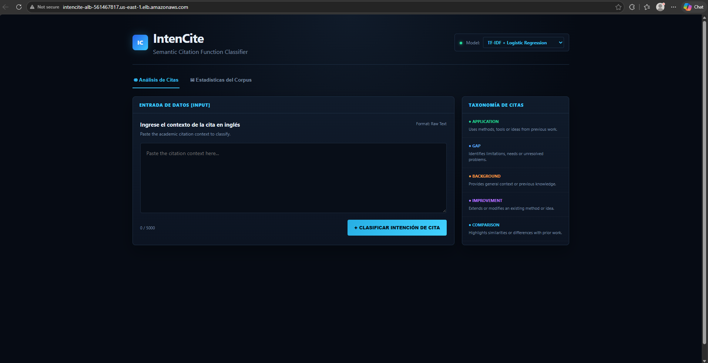
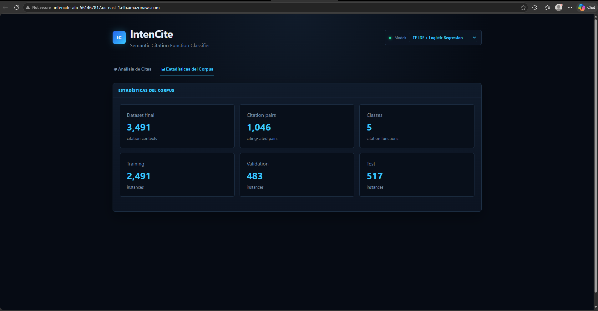
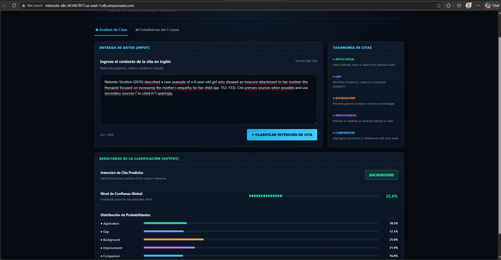

# Manual de Usuario - IntenCite

## 1. Introducción

IntenCite es una aplicación web que permite identificar automáticamente la función semántica que cumple una cita dentro de un texto académico.

El usuario proporciona un contexto de citación escrito en inglés y la aplicación devuelve:

- La función de citación predicha.
- El nivel de confianza de la predicción.
- La probabilidad asignada a cada una de las cinco categorías disponibles.
- El modelo utilizado para realizar la inferencia.

La aplicación emplea un modelo supervisado de procesamiento de lenguaje natural y consume sus predicciones mediante una API.

## 2. Objetivo de la aplicación

IntenCite busca facilitar el análisis de literatura científica. Su propósito es ayudar a reconocer cómo se utiliza una referencia dentro de un artículo, distinguiendo si esta:

- Proporciona antecedentes.
- Evidencia un vacío de investigación.
- Es utilizada por el trabajo citante.
- Es extendida o mejorada.
- Se compara con el trabajo actual.

IntenCite funciona como una herramienta de apoyo al análisis. La predicción no sustituye la interpretación de un investigador.

## 3. Acceso a IntenCite

La aplicación puede utilizarse de dos maneras.

### 3.1 Despliegue en la nube

Abra en un navegador la dirección proporcionada para el despliegue de IntenCite.

La infraestructura dirige las solicitudes del navegador a un balanceador de carga. Este distribuye las solicitudes entre el tablero web y la API de inferencia.

> La dirección pública puede cambiar cuando se destruye y se vuelve a crear la infraestructura.

### 3.2 Ejecución local

Cuando la aplicación se ejecuta localmente mediante Docker Compose, el tablero está disponible en:

```text
http://localhost:8080
```

La API está disponible en:

```text
http://localhost:8001
```

La documentación interactiva de la API puede consultarse en:

```text
http://localhost:8001/docs
```

## 4. Descripción de la interfaz

La interfaz principal contiene los siguientes elementos:

1. **Área de entrada:** campo en el que se introduce el contexto de la cita.
2. **Acción de clasificación:** botón que envía el texto a la API.
3. **Categoría predicha:** función de citación seleccionada por el modelo.
4. **Nivel de confianza:** probabilidad asignada a la categoría predicha.
5. **Distribución de probabilidades:** comparación de la probabilidad asignada a cada categoría.
6. **Modelo utilizado:** identificación del modelo que generó la respuesta.



La pantalla principal permite:

- Consultar el modelo activo en la esquina superior derecha.
- Cambiar entre las pestañas **Análisis de Citas** y **Estadísticas del Corpus**.
- Ingresar un contexto de citación de hasta 5000 caracteres.
- Consultar la taxonomía de las cinco categorías.
- Ejecutar una clasificación mediante el botón **Clasificar intención de cita**.


### 4.1 Estadísticas del corpus

La pestaña **Estadísticas del Corpus** presenta información resumida sobre los datos utilizados para desarrollar y evaluar el modelo.



La interfaz muestra:

- **3491** contextos de citación.
- **1046** pares entre artículo citante y artículo citado.
- **5** funciones de citación.
- **2491** instancias de entrenamiento.
- **483** instancias de validación.
- **517** instancias de prueba.

Estas estadísticas permiten conocer el alcance del conjunto de datos utilizado por IntenCite.

### 5.1 Ingresar el contexto

Pegue el fragmento académico en el campo de texto. Antes de continuar, verifique que el contexto incluya la oración donde aparece la cita.


### 5.2 Ejecutar y consultar la predicción

Presione el botón de clasificación. Cuando la API termine de procesar el texto, la interfaz mostrará la categoría predicha, el nivel de confianza y la distribución de probabilidades.



## 5. Cómo realizar una clasificación

### 5.1 Preparar el contexto

Seleccione un fragmento en inglés que contenga una cita o describa explícitamente la relación con otro trabajo académico.

Para obtener un resultado más interpretable:

- Incluya la oración completa donde aparece la cita.
- Añada las oraciones anterior y posterior cuando aporten contexto.
- Evite ingresar únicamente el apellido de un autor o el identificador de una referencia.
- Compruebe que el texto permita reconocer cómo se utiliza el trabajo citado.

El contexto debe cumplir estas condiciones técnicas:

- Tener entre 20 y 5000 caracteres.
- Contener al menos tres palabras.
- Estar escrito preferiblemente en inglés, debido al idioma del conjunto de entrenamiento.

### 5.2 Ingresar el texto

Pegue el contexto en el campo:

```text
Paste the citation context here...
```

Ejemplo:

```text
We use the parser introduced by Smith et al. (2020) to preprocess all documents in our corpus.
```

### 5.3 Ejecutar la clasificación

Presione el botón de clasificación.

El tablero enviará el texto a la API mediante el endpoint:

```text
POST /api/v1/predict
```

Espere hasta que aparezca el resultado. No cierre ni recargue la página mientras se procesa la solicitud.

### 5.4 Consultar el resultado

La respuesta presenta:

- La categoría predicha.
- La confianza asociada.
- Las probabilidades de las cinco categorías.
- El modelo empleado para la inferencia.


En el ejemplo, la interfaz muestra:

- La intención predicha: **Background**.
- El nivel de confianza global.
- La probabilidad asignada a cada una de las cinco categorías.
- Una representación gráfica que permite comparar las probabilidades.

Una confianza baja o probabilidades muy cercanas indican que el contexto puede ser ambiguo para el modelo.

## 6. Categorías de clasificación

| Categoría | Interpretación |
|---|---|
| **Background** | La referencia proporciona antecedentes, conceptos o información general sobre el dominio. |
| **Gap** | La referencia ayuda a evidenciar una limitación, necesidad o problema aún no resuelto. |
| **Application** | El trabajo citante utiliza una idea, método, recurso, herramienta o conjunto de datos del trabajo citado. |
| **Improvement** | El trabajo citante extiende, adapta o mejora una idea o método presentado previamente. |
| **Comparison** | El texto establece similitudes, diferencias o comparaciones con el trabajo citado. |

## 7. Ejemplo completo

Considere el siguiente contexto:

```text
Unlike the approach proposed by Johnson et al. (2019), our model does not require manually defined linguistic features.
```

Procedimiento:

1. Copie el fragmento.
2. Péguelo en el área de entrada.
3. Ejecute la clasificación.
4. Revise la categoría predicha.
5. Compare las probabilidades de las cinco categorías.

En este ejemplo, una predicción esperable sería **Comparison**, porque el texto contrasta el método actual con un trabajo anterior.

La categoría mostrada realmente dependerá de la inferencia producida por el modelo desplegado.

## 8. Interpretación de la confianza

La confianza corresponde a la probabilidad que el modelo asigna a la categoría seleccionada.

Una confianza alta indica que, según los patrones aprendidos por el modelo, una categoría sobresale frente a las demás. Sin embargo, no garantiza que la clasificación sea correcta.

Cuando dos o más categorías presentan probabilidades similares, el contexto puede ser ambiguo. En ese caso se recomienda:

- Revisar el fragmento completo.
- Ampliar la ventana de contexto.
- Comprobar si el texto expresa más de una función de citación.
- Interpretar la predicción con criterio académico.

Las probabilidades no deben entenderse como una medición de la calidad, relevancia o veracidad del artículo citado.

## 9. Uso de la API

Además del tablero, la predicción puede solicitarse directamente a la API.

Ejemplo de solicitud local:

```bash
curl -X POST "http://localhost:8001/api/v1/predict" \
  -H "Content-Type: application/json" \
  -d '{
    "context": "We use the parser introduced by Smith et al. (2020) to preprocess all documents in our corpus.",
    "model": "tfidf-logreg-baseline-v1"
  }'
```

La respuesta tiene una estructura similar a esta:

```json
{
  "model": "tfidf-logreg-baseline-v1",
  "prediction": "Application",
  "confidence": 0.72,
  "probabilities": {
    "Application": 0.72,
    "Background": 0.11,
    "Comparison": 0.07,
    "Gap": 0.04,
    "Improvement": 0.06
  }
}
```

> Los valores anteriores son ilustrativos. Las probabilidades reales dependen del texto suministrado.

Los modelos disponibles pueden consultarse mediante:

```text
GET /api/v1/models
```

El estado básico de la API puede verificarse mediante:

```text
GET /health
```

## 10. Mensajes y problemas frecuentes

### El texto no puede enviarse

Compruebe que:

- El campo no esté vacío.
- El texto tenga al menos 20 caracteres.
- El fragmento contenga tres palabras o más.
- El texto no exceda los 5000 caracteres.

### La aplicación no muestra resultados

1. Espere algunos segundos y vuelva a intentarlo.
2. Verifique que la aplicación siga abierta.
3. Si utiliza la instalación local, confirme que ambos contenedores estén activos.
4. Consulte el endpoint `/health` para verificar el estado de la API.
5. Informe al administrador si el problema persiste.

### La categoría parece incorrecta

Amplíe el contexto ingresado y compruebe que el fragmento permita reconocer la relación entre el trabajo citante y el citado.

Recuerde que IntenCite es un prototipo académico y puede cometer errores, especialmente ante textos ambiguos o distintos del dominio utilizado durante el entrenamiento.

### La dirección del despliegue no responde

La infraestructura en la nube puede encontrarse detenida o destruida para evitar consumo innecesario de recursos. Solicite al administrador que ejecute nuevamente el flujo de despliegue.

## 11. Limitaciones

- El modelo fue desarrollado principalmente con contextos académicos en inglés.
- Las categorías se redujeron a cinco funciones de citación.
- Un contexto puede expresar más de una función, aunque el sistema entrega una sola categoría principal.
- El modelo puede presentar menor desempeño ante dominios o estilos de escritura diferentes a los datos de entrenamiento.
- La confianza del modelo no reemplaza la validación humana.
- La versión actual utiliza el modelo `tfidf-logreg-baseline-v1`.

## 12. Buenas prácticas

- Introduzca suficiente contexto para interpretar la cita.
- Utilice textos académicos en inglés.
- Compare la predicción con la distribución completa de probabilidades.
- Revise manualmente los casos ambiguos.
- No utilice la predicción como única evidencia para tomar decisiones académicas.